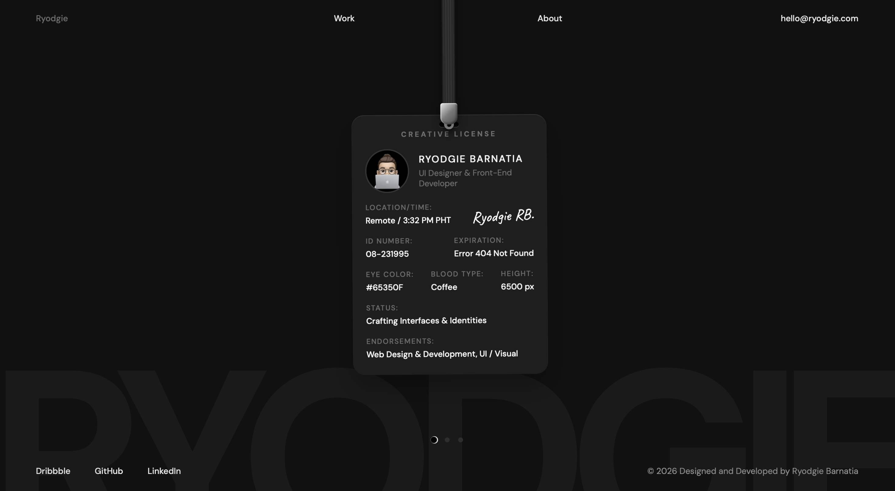
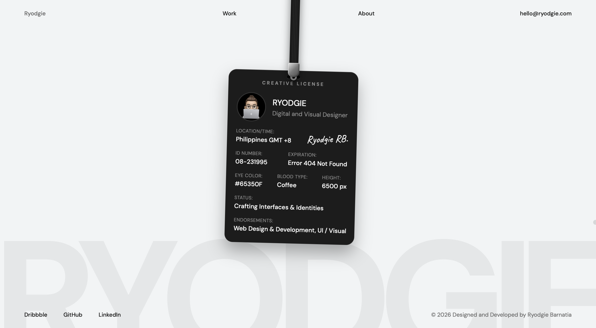

# Portfolio V1 — Ryodgie Barnatia

**Live:** [ryodgie-portfolio-v1.vercel.app](https://ryodgie-portfolio-v1.vercel.app)

Personal portfolio website — Visual & Web Designer and Front-end Developer.

---

## Stack

- React 18 + TypeScript
- Vite
- Framer Motion
- Lenis (smooth scroll)
- Vanilla CSS
- React Router DOM
- React Helmet Async

---

## Structure

    src/
    ├── components/         # Reusable UI pieces
    │   ├── Cursor/
    │   ├── DetailItem/
    │   ├── DotsNav/
    │   ├── Footer/
    │   ├── ImageWithSkeleton/
    │   ├── LicenseCard/
    │   ├── Navbar/
    │   ├── PageTransition/
    │   ├── ProjectCard/
    │   ├── ProjectThumb/
    │   └── ScrollToTop/
    ├── sections/           # Full-page layout units
    │   ├── Hero/
    │   ├── Work/
    │   └── About/
    ├── hooks/              # Custom React hooks
    │   ├── useBodyScrollLock
    │   ├── useFocusTrap
    │   ├── useIsMobile
    │   ├── useLenis
    │   ├── useMousePosition
    │   ├── useReveal
    │   ├── useRouteState
    │   └── useSwipeNavigation
    ├── data/               # All content lives here
    │   ├── profile.ts
    │   ├── projects.ts
    │   └── about.ts
    ├── styles/             # Design tokens + global resets
    │   ├── variables.css
    │   └── global.css
    ├── types/              # Shared TypeScript interfaces
    └── utils/              # Pure utility functions

---

## Getting Started

    npm install
    npm run dev

## Build

    npm run build
    npm run preview

---

## Features

- ID card hero with lanyard drop and swing animation
- Dot navigation with keyboard arrow keys and swipe gestures for page switching
- Work overlay with dynamic card spread and hover lift
- Mobile card stack with drag to swipe
- Custom cursor that expands to VIEW on project card hover
- Lenis smooth scroll on case study and about pages
- Framer Motion page transitions
- System-aware dark mode (dark default, light override via prefers-color-scheme)
- Fluid typography via CSS clamp()
- Scroll reveal animations on About page
- Focus trap on Work overlay
- Keyboard navigation support on project cards
- Per-page document titles
- Open Graph meta tags
- robots.txt and sitemap.xml
- CSP header and security headers via vercel.json
- Brotli + gzip compression on build
- Fully responsive — mobile, tablet, desktop

---

© 2026 Ryodgie Barnatia
